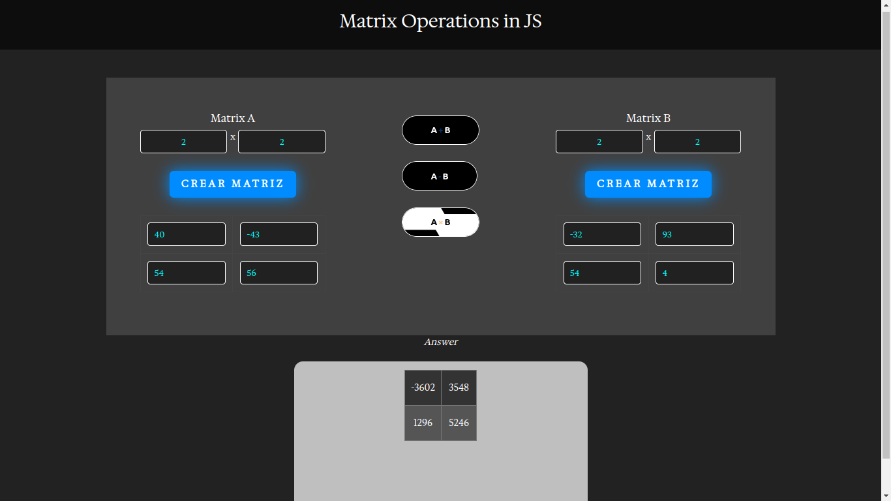

# Proyecto de Operaciones Matriciales

Este proyecto proporciona una serie de funciones para realizar operaciones básicas con matrices, como sumar, restar y multiplicar

## Cómo usar

1. Clona este repositorio en tu máquina local: 
`git clone https://github.com/yisusAbet24/JSMatrixBasics.git`

# Inicio Rápido:

Abre el archivo index.html en tu navegador preferido.
Explora la interfaz amigable para realizar operaciones matriciales básicas.
